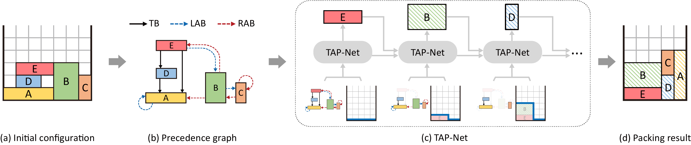
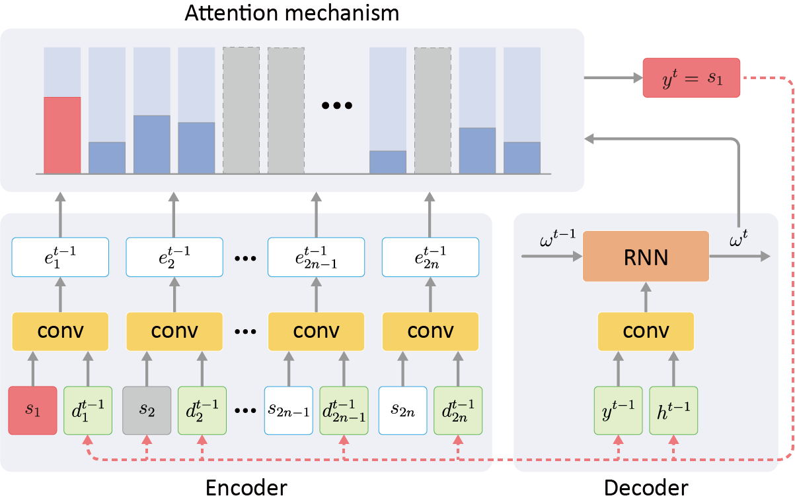

# TAP-Net: Transport-and-Pack using Reinforcement Learning




## Introduction

We introduce the transport-and-pack(TAP) problem, a frequently encountered instance of real-world packing, and develop a neural optimization solution based on reinforcement learning. 
Given an initial spatial configuration of boxes, we seek an efficient method to iteratively transport and pack the boxes compactly into a target container. Due to obstruction and accessibility constraints, our problem has to add a new search dimension, i.e., finding an optimal em transport sequence, to the already immense search space for packing alone. Using a learning-based approach, a trained network can learn and encode solution patterns to guide the solution of new problem instances instead of executing an expensive online search. In our work, we represent the transport constraints using a precedence graph and train a neural network, coined TAP-Net, using reinforcement learning to reward efficient and stable packing. 

For more details and materials, please refer to our [project page](https://vcc.tech/research/2020/TAP).

<!--  {width: 50%} -->
<div align=center>

</div>

## Dependencies
* Python 3.7
* Pytorch 1.1.0
* numpy
* matplotlib
* networkx
* scipy
* copy
* tqdm


## Usage

All codes are tested under PyTorch 1.1.0 and Python 3.7 on Ubuntu 18.04 and Windows 10.
### Training
```
./scripts/train.sh
```
### Testing
```
./scripts/test.sh
```
### Testing on large number of blocks (rolling)
```
./scripts/rolling.sh
```
### Just generate data
```
./scripts/generate.sh
```


## File structure:

* **data/**: Dataset folder, generated by code, see [data.md](./doc/data.md) for more detial.
* **pack/**: Training/testing result.
* **pack_net/**: Code to train pack net.
* **pretrain_model/**: Some models we trained before.
* **scripts/**: Some scripts to train/test network.

* **tools.py**: Consists of 3 parts: painting functions, packing functions and feasibility functions.
* **generate.py**: Use to generate training/testing data.
* **model.py**: Define the network structure.
* **pack.py**: Laod training/testing data, update dynamic data and mask.
* **train.py**: Main code to run the network, we set some parameters to contorll the training.

### Parameters of train.py
    ========= Task setting =========
    --task: string, the task to do
        "generate" : only generate data
        "test": test the network without training
        "train": train the network
    --note: string, any words you want to say
        When the train.py is running, it will create a folder under pack/ to store the result, and the note string will be a part of the folder's name
    --use_cuda: bool, use CUDA to run network
        True
        False
    --cuda: string, the id of GPU you want to use
        "0"
    --checkpoint: string, the location of pre-trained network model
        If the path for a model of network is "./netwrok/model/actor.pt", then the checkpoint should be "./network/model/"

    ========= Training/testing setting =========
    --train_size: int, the number of training data
    --valid_size: int, the number of testing data
    --epoch_num: int, epoch num
    --batch_size: int, batch size, default as 128

    ========= Data setting =========
    --obj_dim: int, the block's dimension
    --nodes: int, the number of blocks
    --dataset: string, the dataset
        "RAND": randonly generate blocks
        "PPSG": generate blocks which can be packed into container perfectly
        "MIX": half data from "RAND", half from "PPSG"
    --unit: float, the resolution of length, default as 1.0
    --arm_size: int, the size of robot arm to pass and rotate a block, default as 1
    --min_size: int, minimun size of block
    --max_size: int, maximun size of block
    --container_width: int, target container width
    --initial_container_width: int, initial container width

    ========= Packing setting =========
    --packing_strategy: string, the packing strategy want to use
        "LB_GREEDY" : Use left-bottom greedy packing strategy
        "LB"        : Use left-bottom packing strategy
        "MACS"      : Use Maximize-Accessible-Convex-Space packing strategy
        "MUL"       : Use Multiple Empty-Maximal-Space packing strategy
        # pack net strategy
        "pre_train" : Use pretrain pack net to pack in TAP-Net and train the pack net meanwhile
        "pre_eval"  : Use pretrain pack net to pack in TAP-Net
        "none_train": Use initial pack net to pack in TAP-Net and train the pack net meanwhile
        "none_eval" : Use initial pack net to pack in TAP-Net

    --reward_type: string, the reward want to use
        "C+P+S-lb-soft" : Use stablilty as soft constrain, use (C+P+S)/3 as reward
        "C+P+S-lb-hard" : Use stablilty as hard constrain, use (C+P+S)/3 as reward
        "C+P+S-mcs-soft": Use stablilty as soft constrain, use (C+P+S)/3 as reward
        "C+P+S-mcs-hard": Use stablilty as hard constrain, use (C+P+S)/3 as reward
        "C+P+S-mul-soft": Use stablilty as soft constrain, use (C+P+S)/3 as reward
        "C+P+S-mul-hard": Use stablilty as hard constrain, use (C+P+S)/3 as reward
        # pack net strategy
        "C+P+S-RL-soft" : When packing strategy is pnet, use local pnet, use stablilty as soft constrain, use (C+P+S)/3 as reward
        "C+P+S-SL-soft" : When packing strategy is pnet, use local pnet, use stablilty as soft constrain, use (C+P+S)/3 as reward
        "C+P+S-G-soft"  : When packing strategy is pnet, use global pnet, use stablilty as soft constrain, use (C+P+S)/3 as reward
        "C+P+S-LG-soft" : When packing strategy is pnet, use local+global pnet, use stablilty as soft constrain, use (C+P+S)/3 as reward

    ========= Network setting =========
    --input_type: string, the data type you want to use, default as 'bot'
        "bot"       : Block need to pack with robot and container constrain, so there are left/right precedence data
        "simple"    : Block can't be rotate
        "rot"       : Block can rotate witout constrain
        "mul"       : Block belongs to multi-container, but only feed the id info into network
        "mul-with"  : Block belongs to multi-container, feed the id info into network
        For more detial plase check class PackDataset in pack.py
    --decoder_input_type: string, the input tyep of decoder in TAP-Net
        "shape_heightmap"   : Take the block shape and heightmap as input of decoder
        "shape_only"        : Take the block shape as input of decoder
        "heightmap_only"    : Take the heightmap as input of decoder
    --heightmap_type: string, the heightmap representation
        "diff"  : Use gradient heightmap
        "zero"  : Use zero-min heightmap
        "full"  : Use raw heightmap
    --allow_rot: bool, True if you allow block to rotate

    --encoder_hidden: int, the features dimension of the static elements of encoder
    --decoder_hidden: int, the features dimension of the dynamic elements of decoder
    --actor_lr: float, learning rate of actor
    --critic_lr: float, learning rate of critic

    --dropout: float, dropout probability
    --max_grad_norm: float, max norm of the gradients
    --n_process_blocks: int, times of glimpse in critic network
    --layers: int, the number of GRU layer in actor/critic network

    
Example:

    python trainer.py \
        --cuda=0 \
        --note=training \
        \
        --task=train \
        --valid_size=10 \
        --train_size=1280 \
        --epoch_num=200 \
        --dataset=RAND \
        --packing_strategy=LB_GREEDY \
        \
        --nodes=10 \
        --obj_dim=2 \
        --input_type=bot \
        --reward_type=C+P+S-lb-soft \
        \
        --unit=1 \
        --arm_size=1 \
        --min_size=1 \
        --max_size=5 \
        --container_width=5 \
        --container_height=50 \
        --initial_container_width=7 \
        --initial_container_height=50


This command means you want to train the network in **2D** condition, using the **RAND** dataset, the training data size is **1280**, the task is packing **10** blocks into a container, the initial container size is **7** x inf, the target container size is **5** x inf, reward type is **C+P+S-lb-soft**.

Then it will generate a folder unber `pack/` folder to store the training or testing result.
The folder structure of `pack` looks like this:

    pack/
        10/  <--- nodes=10
            2d-bot-C+P+S-lb-soft-LB_GREEDY-width-5-note-*some-useless-words*-2020-09-02-14-0/ <--- the folder create by our code
                checkpoints/    <--- store models of each epoch
                    0/          <--- the epoch num
                    1/
                    ...
                render/         <--- store the testing result of each epoch
                    0/  
                    1/
                    ...

The `data/` folder contain the training and testing data, the folder structure of `pack` looks like this:

    data/
        rand_2d/
            pack-train-10-1280-7-1-5/
                blocks.txt      <--- blocks data, container each rotation type
                pos.txt         <--- blocks' positons in initial container
                dep_move.txt    <--- movement dependency
                dep_large.txt   <--- rotation dependency (left/forward)
                dep_small.txt   <--- rotation dependency (right/backward)
                container.txt   <--- only use in multi-target container task, just some random generated target container id for blocks

Under these folders, we have many kinds for dataset, `pack-train-10-1280-7-1-5` means the training dataset with 1280 data, each data has 10 blocks, the initial container width is 7, the block size is from 1\~5. `pack-valid-6-100-5-1-4` means the testing dataset with 100 data, each data has 6 blocks, the initial container width is 5, the block size is from 1\~4. See [data.md](./doc/data.md) for more detial.

## Citation
Please cite the paper in your publications if it helps your research:
```
@article{TAPNet20,
title = {TAP-Net: Transport-and-Pack using Reinforcement Learning},
author = {Ruizhen Hu and Juzhan Xu and Bin Chen and Minglun Gong and Hao Zhang and Hui Huang},
journal = {ACM Transactions on Graphics (Proceedings of SIGGRAPH ASIA 2020)},
volume = {39},
number = {6},
pages = {232:1~232:15},
year = {2020},
}
```
## License
Our code is released under MIT License. See LICENSE file for details.


## Acknowledgements
Thanks to [mveres01/pytorch-drl4vrp](https://github.com/mveres01/pytorch-drl4vrp) for getting the start of our code.