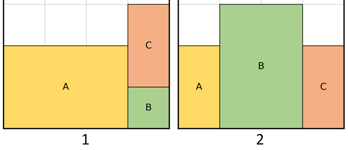

# Dataset
This file is a description about the folder structure of `data` folder

## Generate and load data
These data is generated by the function `create_dataset()` or `create_dataset_gt()` in `pack.py`, for more detial please check these code. The process of loading data is done by the class `PACKDataset` in `pack.py`.

## Folder structure:
* **rand_2d/**: Random data on 2D case 
* **rand_3d/**: Random data on 2D case 
* **gt_2d/**: PPSG data on 2D case 
* **gt_3d/**: PPSG data on 3D case 

Each dataset will generate under these main folder, for example:
* rand_2d/
    * pack-train-10-12800-7-1-5/
        * blocks.txt        : The 2D / 3D size of blocks
        * pos.txt           : The position of blocks in intial container
        * dep_move.txt      : The top block states of each block
        * dep_small.txt     : The left / forward access block states of each block
        * dep_large.txt     : The right / backward access block states of each block
        * container.txt     : The target container id of each block (only use for multi-container case)
        
Under these folders, we have many kinds for dataset, `pack-train-10-1280-7-1-5` means the training dataset with 1280 data, each data has 10 blocks, the initial container width is 7, the block size is from 1~5. `pack-valid-6-100-5-1-4` means the testing dataset with 100 data, each data has 6 blocks, the initial container width is 5, the block size is from 1~4.

## Data structure:

Let number of blocks is **n**, data size is **D**, inital container size if **w**
* **blocks.txt**

    In 2D case, the number of input block states is (n\*2), (n\*6) for 3D case. Each line of data is n blocks size unber a rotation state, the total number of lines of the file is (D\*2) for 2D, (D\*6) for 3D

* **pos.txt**

    Each line of data is the position of each block in initial container, the total number of lines of the file is (D)

* **dep_move.txt**

    We generate a 2D top block/precedence array with size of (n)\*(n), then flatten into a 1D array (n\*n). Each line of data is the top block/precedence data, the total number of lines of the file is (D)

* **dep_small.txt**

    Since we have 2 rotation states for 2D, 6 rotation states for 3D, we should generate 2D left/forward block/precedence array with size of (n)\*(n), then flatten into a 1D array (n\*n) for each rotation state. Each line of data is the left/forward block/precedence data for a rotation state, the total number of lines of the file is (D\*2) for 2D, (D\*6) for 3D

* **dep_large.txt**

    Since we have 2 rotation states for 2D, 6 rotation states for 3D, we should generate 2D right/backward block/precedence array with size of (n)\*(n), then flatten into a 1D array (n\*n) for each rotation state. Each line of data is the right/backward block/precedence data for a rotation state, the total number of lines of the file is (D\*2) for 2D, (D\*6) for 3D

* **container.txt**

    Each line of data is a targe container id of each block, which is generate randomly, only use for multi-container case

## Example

Take the data shows in the figure as example, we want to generate 2 groups of data of 3 blocks in 2D case



* **block.txt**

    * For data 1, we have 3 blocks with size: [3,2],[1,1],[1,2]
    * For data 2, we have 3 blocks with size: [1,2],[2,3],[1,2]
    * The block.txt will be:
    ```
    3 2 1 1 1 2  #  data 1 original state
    2 3 1 1 2 1  #  data 1 rotated by Z axis
    1 2 2 3 1 2  #  data 2 original state
    2 1 3 2 2 1  #  data 2 rotated by Z axis
    ```
* **pos.txt**

    * For data 1, we have 3 positons of each block: [0,0],[3,0],[3,1]
    * For data 2, we have 3 positons of each block: [0,0],[1,0],[3,0]
    * The pos.txt will be:
    ```
    0 0 3 0 3 1  #  data 1 block positions
    0 0 1 0 3 0  #  data 2 block positions
    ```
* **dep_move.txt**

    * For data 1, we can generate the 2D top block array, denote the array as **B**, B[i][j] means block j is blocked by block i:
        ```
        0 0 0
        0 0 0
        0 1 0
        ```
    * For data 2, we can generate the 2D top block array, denote the array as **B**, B[i][j] means block j is blocked by block i:
        ```
        0 0 0
        0 0 0
        0 0 0
        ```
    * The dep_move.txt will be:
    ```
    0 0 0 0 0 0 0 1 0  #  data 1 top block array (after flattened)
    0 0 0 0 0 0 0 0 0  #  data 2 top block array (after flattened)
    ```
* **dep_small.txt**

    * For data 1, we can generate the 2D left/forward block array, denote the array as **B**, B[i][j] means block j is blocked by block i:
        ```
        1 1 1
        0 0 0
        0 0 0
        ```
    * For data 2, we can generate the 2D left/forward block array, denote the array as **B**, B[i][j] means block j is blocked by block i:
        ```
        1 1 0
        0 0 1
        0 0 0
        ```
    * The dep_small.txt will be:
    ```
    0 0 0 0 0 0 0 0 0  #  data 1 block array (after flattened) of rotation state 1, since rotation state 1 (original state) doesn't need to grasp from left size of block, we don't need to consider about its left block state
    1 1 1 0 0 0 0 0 0  #  data 1 left block array (after flattened) of rotation state 2
    0 0 0 0 0 0 0 0 0  #  data 2 block array (after flattened) of rotation state 1, since rotation state 1 (original state) doesn't need to grasp from left size of block, we don't need to consider about its left block state
    1 1 0 0 0 1 0 0 0  #  data 2 left block array (after flattened) of rotation state 2
    ```
* **dep_large.txt**

    * For data 1, we can generate the 2D right/backward block array, denote the array as **B**, B[i][j] means block j is blocked by block i:
        ```
        0 0 0
        1 1 0
        1 0 1
        ```
    * For data 2, we can generate the 2D right/backward block array, denote the array as **B**, B[i][j] means block j is blocked by block i:
        ```
        0 0 0
        1 0 0
        0 1 1
        ```
    * The dep_large.txt will be:
    ```
    0 0 0 0 0 0 0 0 0  #  data 1 block array (after flattened) of rotation state 1, since rotation state 1 (original state) doesn't need to grasp from right size of block, we don't need to consider about its right block state
    0 0 0 1 1 0 1 0 1  #  data 1 right block array (after flattened) of rotation state 2
    0 0 0 0 0 0 0 0 0  #  data 2 block array (after flattened) of rotation state 1, since rotation state 1 (original state) doesn't need to grasp from right size of block, we don't need to consider about its right block state
    0 0 0 1 0 0 0 1 1  #  data 2 right block array (after flattened) of rotation state 2
    ```