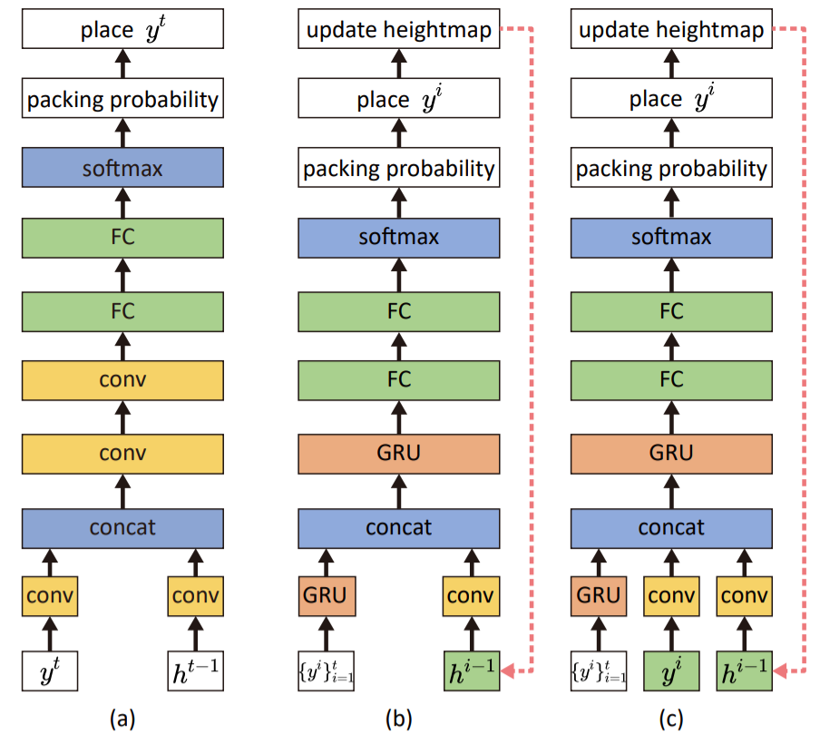

# Pack net

## File structure:
    
* **L_SL.py**: Code to train local pack net with supervised learning
* **L_RL.py**: Code to train local pack net with reinforcement learning
* **LG_RL.py**: Code to train global/(local+global) pack net with reinforcement learning
* **convert_gt_pos.py**: Code to generate heightmap data required for supervised learning, it reads the data generated by `generate.sh` then save new file `xx_height_map.txt` and 'xx_pos_map.txt'

## Training/testing
* First we should generate training and testing dataset using the [`generate.sh`](../generate.sh) located in project root folder, the pack net loads data from `../data`:
```
(project root)> ../generate.sh
```
* Training/testing **local pack net using supervised learning**, you need to generate two more data file based on the data generated by `generate.sh`, run `convert_gt_pos.py` first, then train the network, you can modify the training adn testing setting on main function:
```
(current folder)> python convert_gt_pos.py
(current folder)> python L_SL.py
```
* Training/testing **local pack net using reinforcement learning**, you can modify the training adn testing setting on main function:
```
(current folder)> python L_RL.py
```
* Training/testing **global pack net using reinforcement learning**, you can modify the training adn testing setting on main function:
```
(current folder)> python LG_RL.py
```
* Training/testing **local+global pack net using reinforcement learning**, you can modify the training adn testing setting on main function:
```
(current folder)> python LG_RL.py
```
* NOTE: If you want to train TAP-Net with pack net, you need to modify the checkpoint path of pack net in `calc_one_position_net()` or `calc_positions_LG_net()` or `calc_positions_net()` in [`tools.py`](../tools.py) based on your setting

## Pack net structure

